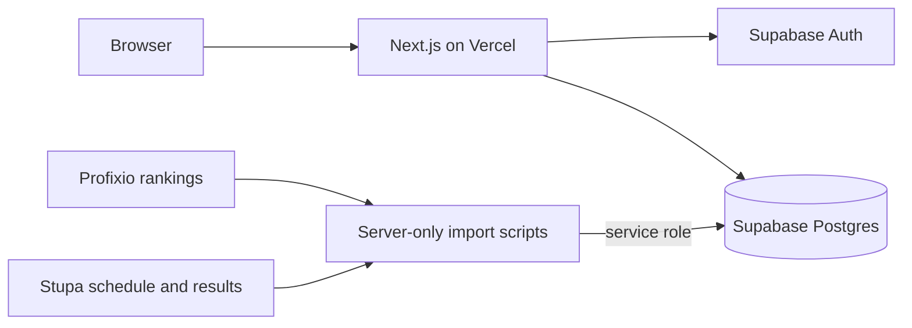
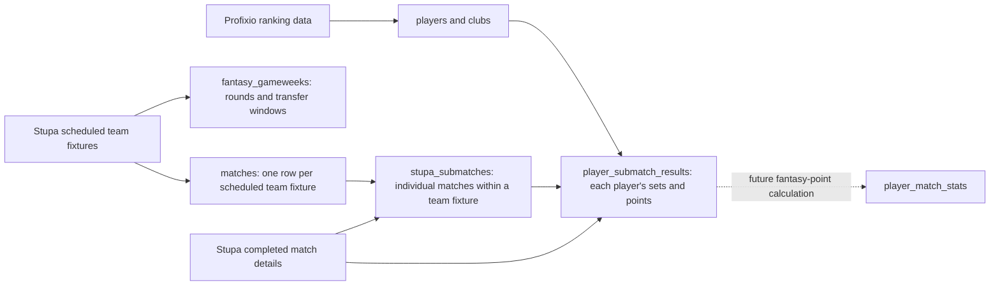

# Architecture

Fantasy Pingisligan is a Next.js App Router application backed by Supabase Auth
and Postgres. Vercel can host the web application; data imports run separately
as trusted server-side jobs.

## Web application

- Server Components render routes and read data with the server Supabase client.
- Authentication checks use verified JWT claims through `auth.getClaims()`.
- Middleware refreshes the Supabase session cookies when necessary.
- The dashboard initially loads only the current fantasy team and its squad.
- Opening a player picker triggers `GET /api/players`; the player pool is not
  included in the initial dashboard render.
- Squad changes use Server Actions. Every mutation rechecks authentication,
  transfer locks, ownership, squad rules and budget on the server.
- Supabase Row Level Security remains the database-level authorization boundary.

## Data pipeline

The data sources have a required dependency order:

`fantasy_gameweeks` does not contain every fixture itself. It represents a
round and stores the first and last match times plus the transfer lock window.
The individual team fixtures are rows in `matches`, linked back to their
gameweek through `fantasy_gameweek_id`.

The Stupa schedule and completed results are two views of the same real-world
team fixtures. The schedule importer creates the parent `matches` rows before
play. After play, the results importer attaches the individual submatches and
per-player set/point details to those existing fixtures. The current results
importer stores source results but does not calculate fantasy points;
`player_match_stats` and gameweek totals are the later scoring layer.

## Trust boundaries

Public Supabase URL and anonymous keys may be used by the web app. The service
role key bypasses RLS and is restricted to local/server import jobs. Scraping,
source parsing and service-role writes belong in `scripts/`, a scheduled GitHub
Action, or another trusted server environment—not a Client Component.
