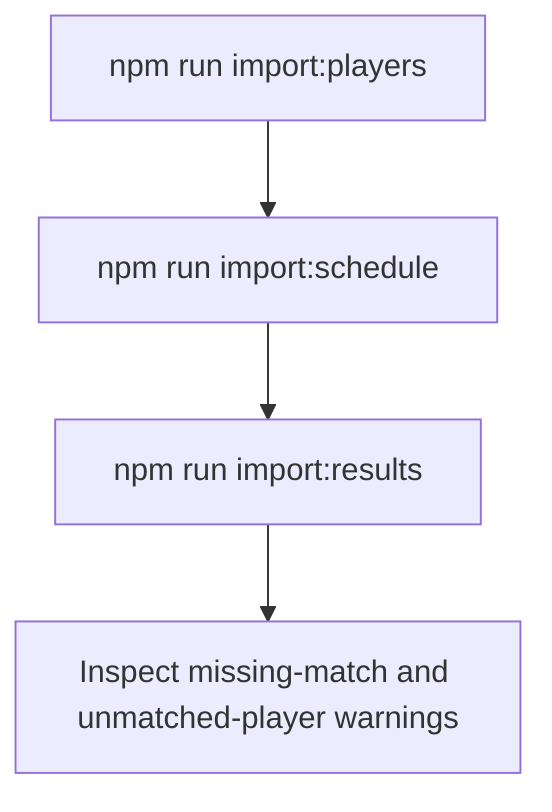

# Data imports

All import scripts run server-side and load `.env.local` and then `.env`. Dry
runs fetch and parse source data without writing to Supabase.

Stupa is the upstream data source; schema migrations are run in Supabase, not
Stupa. When developers share one Supabase project, migrations and real imports
affect that shared project and generally need to be performed by only one
developer. Dry runs remain local and do not write database data.

## Required order

1. **Players** creates clubs and players from Profixio rankings.
2. **Schedule** creates Stupa rounds as gameweeks and their parent matches.
3. **Results** attaches Stupa submatches and player results to those matches.



## Configuration

Real imports require:

```dotenv
NEXT_PUBLIC_SUPABASE_URL=your-project-url
SUPABASE_SERVICE_ROLE_KEY=your-private-service-role-key
```

`SUPABASE_URL` may replace the public URL for scripts. Schedule and result
imports default to Stupa stage `5727`; set `STUPA_STAGE_ID` to override it.

Bash:

```bash
STUPA_STAGE_ID=4521 npm run import:schedule:dry
STUPA_STAGE_ID=4521 npm run import:results:dry
```

## Commands and writes

| Command | Source | Main writes |
| --- | --- | --- |
| `npm run import:players` | Profixio rankings | `clubs`, `players` |
| `npm run import:schedule` | Stupa stage matches | `clubs`, `fantasy_gameweeks`, `matches` |
| `npm run import:results` | Stupa completed submatches | `stupa_submatches`, `player_submatch_results`, player identity link |

Each command has a `:dry` variant. Use it first when changing a stage, source
endpoint or parser. The writers use stable source identifiers and upserts, so a
later run refreshes existing source rows instead of intentionally duplicating
them.

## Schedule behavior

One fantasy gameweek is built per Stupa round. Transfers lock two hours before
the first match and unlock two hours after the last match. Source times are
interpreted in `Europe/Stockholm` and stored as UTC timestamps.

## Result identity matching

Stupa's player `meta_data.license_id` is matched to `players.profixio_id`. A
matched import also records `stupa_user_role_id` on the player. Unmatched people
are retained in `player_submatch_results` with a null `player_id` and reported
to the console; this preserves source data for later reconciliation.

## Troubleshooting

- **Missing environment variable:** add the named value to `.env.local`.
- **Missing scheduled parent matches:** run the schedule importer for the same
  stage before importing results.
- **Unmatched Stupa player:** check the Stupa license ID against the player's
  Profixio ID; the raw row is retained and can be linked later.
- **Database column/table missing:** apply the migration named in the root README
  or [update guide](updating.md), then retry.
- **Unexpected source response:** use a dry run and confirm that the configured
  stage exists and the upstream endpoint still returns its expected shape.

Fantasy points are not assigned by the result importer yet.
