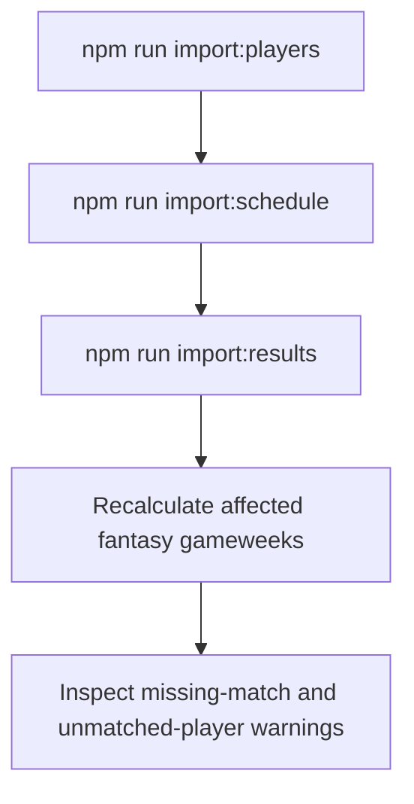

# Data imports

All import scripts run server-side and load `.env.local` and then `.env`. Dry
runs fetch and parse source data without writing to Supabase.

Stupa is the upstream data source; schema migrations are run in Supabase, not
Stupa. When developers share one Supabase project, migrations and real imports
affect that shared project and generally need to be performed by only one
developer. Dry runs remain local and do not write database data.

## Required order

1. **Players** reconciles clubs and permanent player identities from Profixio
   rankings, updates the selected roster, and marks missing roster players
   inactive without deleting or repricing them.
2. **Schedule** creates Stupa rounds as gameweeks and their parent matches.
3. **Results** attaches Stupa submatches and player results, then recalculates
   player and fantasy-team points for every affected gameweek.


```mermaid
flowchart TD
    A[npm run import:players] --> B[npm run import:schedule]
    B --> C[npm run import:results]
    C --> D[Recalculate affected fantasy gameweeks]
    D --> E[Inspect missing-match and unmatched-player warnings]
```

## Configuration

Real imports require:

```dotenv
NEXT_PUBLIC_SUPABASE_URL=your-project-url
SUPABASE_SERVICE_ROLE_KEY=your-private-service-role-key
```

`SUPABASE_URL` may replace the public URL for scripts. Schedule and result
imports default to Stupa stage `5727`; set `STUPA_STAGE_ID` to override it.

Bash:

```bash
STUPA_STAGE_ID=4521 npm run import:schedule:dry
STUPA_STAGE_ID=4521 npm run import:results:dry
```

## Commands and writes

| Command | Source | Main writes |
| --- | --- | --- |
| `npm run import:players` | Profixio rankings | `clubs`, `players`, and completed owners' budgets when prices change |
| `npm run import:schedule` | Stupa stage matches | `clubs`, `fantasy_gameweeks`, `matches` |
| `npm run import:results` | Stupa completed submatches | Raw result tables, `player_match_stats`, snapshot player points, team gameweek totals |

Each command has a `:dry` variant. Use it first when changing a stage, source
endpoint or parser. With Supabase credentials available, the player dry run
also previews creates, updates, license changes, and duplicate merges. The
writers retain historical source identities so a later run refreshes existing
people instead of intentionally duplicating them.

## Player roster and identity reconciliation

The Profixio importer first selects up to ten ranked players for each club in
`clubs.txt`. It refuses a live import if any configured club unexpectedly
returns zero players, preventing a partial source response from deactivating a
whole roster.

Each selected source row is resolved in this order:

1. Match any historical or current SBTF license exactly.
2. If the license is unknown, match a unique normalized name and birth year.
   Club confirms duplicates but is not permanent identity because players can
   transfer.
3. Create a player only when no existing identity matches. Stop for manual
   review when the evidence is ambiguous.

The current source license is stored on `players.profixio_id`, while every old
and current license remains in `player_external_identities`. Confirmed duplicate
records are merged without changing fantasy squad, snapshot, result, or stats
ownership. Selected players become active and receive their current club,
ranking, and price. Previously imported players missing from the selected list
become inactive; their stored price and historical references are unchanged.

Inactive players are hidden from the picker. A team that already owns one may
keep and save that player at the preserved price, but no team can newly select
or re-add an inactive player.

## Player-price refresh and transfer reopening

After the first deadline of the season, real player imports run only as the
final step of an unlocked gameweek refresh. The nightly workflow first imports
available Stupa results and recalculates scores, then runs
`npm run import:players -- --after-unlock`. A normal `npm run import:players`
remains available for preseason setup before any gameweek has started.

The database keeps transfers closed after the scheduled `unlock_at` until the
player import succeeds and records `data_refreshed_at`. When a player price
changes, the database adjusts the budget of every completed team that owned
that player in the pending gameweek snapshot. Remaining cash is unchanged,
while squad and total team values reflect the ranking change. If either import
step fails, the marker remains null and the workflow can be retried safely.

## Schedule behavior

One fantasy gameweek is built per Stupa round. Transfers lock two hours before
the first match. The earliest reopening is 00:00 Swedish time on the day after
the last match; actual reopening happens when the subsequent results and price
refresh succeeds. Source times are interpreted in `Europe/Stockholm` and stored
as UTC timestamps.

## Result identity matching

Stupa's `meta_data.license_id` is matched against every historical SBTF license
in `player_external_identities`. Its `user_role_id` is an independent fallback
identity, so a known role can still resolve a newly changed license. Each new
license and role association is retained for later imports. If the license and
role resolve to different players, the live import stops rather than assigning
points incorrectly.

Unmatched people remain in `player_submatch_results` with a null `player_id`
and are reported to the console. Run the Profixio player import first, then
rerun the results import to resolve newly known licenses. Names are diagnostic
only because they are neither unique nor consistently formatted across both
sources.

## Troubleshooting

- **Missing environment variable:** add the named value to `.env.local`.
- **Missing scheduled parent matches:** run the schedule importer for the same
  stage before importing results.
- **Unmatched Stupa player:** check the Stupa license ID against the player's
  Profixio ID; the raw row is retained and can be linked later.
- **Database column/table missing:** apply the migration named in the root README
  or [update guide](updating.md), then retry.
- **Unexpected source response:** use a dry run and confirm that the configured
  stage exists and the upstream endpoint still returns its expected shape.

Every results import reloads the full Stupa stage. New or changed source rows
replace their stored rows, and every gameweek present in that result set is
recalculated against its locked squad snapshots. This means a later import also
repairs points for an earlier gameweek when a previously missing or inaccurate
score has changed upstream. Player club-win bonuses use the immutable
`player_gameweek_club_snapshots` roster captured at that gameweek's lock, not
the current club on `players`. Inactive players retained in a locked fantasy
squad remain eligible for their historical club-win bonus.
