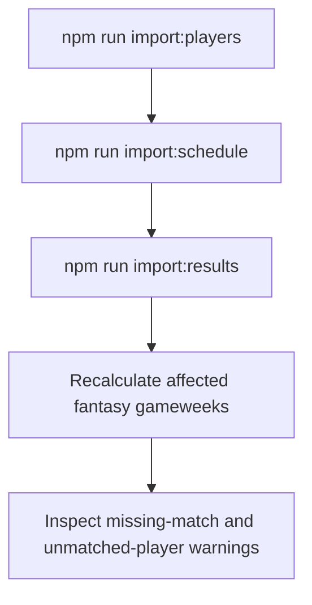

# Data imports

All import scripts run server-side and load `.env.local` and then `.env`. Dry
runs fetch and parse source data without writing to Supabase.

Stupa is the upstream data source; schema migrations are run in Supabase, not
Stupa. When developers share one Supabase project, migrations and real imports
affect that shared project and generally need to be performed by only one
developer. Dry runs remain local and do not write database data.

## Required order

1. **Players** uses the reviewed SBTF squad list and fresh Profixio rankings,
   reconciles clubs and permanent player identities, and marks non-roster players
   inactive without deleting or repricing them.
2. **Schedule** creates Stupa rounds as gameweeks and their parent matches.
3. **Results** attaches Stupa submatches and player results, then recalculates
   player and fantasy-team points for every affected gameweek.


```mermaid
flowchart TD
    A[npm run import:players] --> B[npm run import:schedule]
    B --> C[npm run import:results]
    C --> D[Recalculate affected fantasy gameweeks]
    D --> E[Inspect missing-match and unmatched-player warnings]
```

## Configuration

Real imports require:

```dotenv
NEXT_PUBLIC_SUPABASE_URL=your-project-url
SUPABASE_SERVICE_ROLE_KEY=your-private-service-role-key
```

`SUPABASE_URL` may replace the public URL for scripts. Schedule and result
imports default to Stupa stage `5727`; set `STUPA_STAGE_ID` to override it.

Bash:

```bash
STUPA_STAGE_ID=4521 npm run import:schedule:dry
STUPA_STAGE_ID=4521 npm run import:results:dry
```

## Commands and writes

| Command | Source | Main writes |
| --- | --- | --- |
| `npm run import:players` | SBTF squads + Profixio rankings | `clubs`, `players`, and completed owners' budgets when prices change |
| `npm run import:schedule` | Stupa stage matches | `clubs`, `fantasy_gameweeks`, `matches` |
| `npm run import:results` | Stupa completed submatches | Raw result tables, `player_match_stats`, snapshot player points, team gameweek totals |

Each command has a `:dry` variant. Use it first when changing a stage, source
endpoint or parser. With Supabase credentials available, the player dry run
also previews creates, updates, license changes, and duplicate merges. The
writers retain historical source identities so a later run refreshes existing
people instead of intentionally duplicating them.

## Player roster and identity reconciliation

`data/sbtf-rosters.json` is the reviewed 2026–27 roster from
[SBTF’s Herrlagen page](https://sbtf.se/folja/pingisligan/herrlagen/), checked on
13 September 2026: 53 players across seven clubs. Update this snapshot when
SBTF changes a squad; it is deliberately not scraped during page loads or
silently replaced during nightly imports. `clubs.txt` and `CLUBS_FILE` are no
longer used. There is no ten-player cap or minimum ranking for roster membership.

Imports fetch fresh Profixio points, using the first ranking page and then name
searches in the same ranking run for remaining players (including inactive
ranking entries). Roster license IDs anchor matching; a unique name and birth
year also resolves renewed licenses. If a previously ranked player disappears
or matching becomes ambiguous, the import stops before writing the roster.
SBTF determines a player's fantasy club even when Profixio lists a different one.

Prices retain the existing formula:
`(max(2250, ranking points) - 2200) × 100000`, plus the existing world-ranking
supplement `round(25000000 / sqrt(world ranking position))` when present.
Players below 2250 receive the same base price as a player on 2250 (5m).
Fumiya Igarashi and Machi Asuka are included at a manual price of 10m each while
unranked; their ranking and license fields remain null. Their configured UUIDs
are permanent identity anchors, so repeated imports and later Profixio matches
preserve ownership. Newly available rankings replace the manual price using the
normal formula. An import refuses to revert a previously ranked manual player
to the fallback price when ranking data disappears.

Without an SBTF license or Stupa role identity, these two players cannot yet
receive individually matched Stupa results. The results importer retains and
reports unmatched rows; confirm and register their real license/role identities
when available, then rerun results. Do not invent license numbers.

### Club names and logos

`lib/clubs.ts` defines the SBTF display names, exact source aliases and logo
provenance. Player imports, Stupa schedule imports and the UI share this map.
`Linden BTK Eskilstuna` and the `Esklistuna` spelling resolve to **Eskilstuna by
STIGA**. The separate **Eskilstuna BTK** is not treated as the same club.
Existing aliased club rows are renamed in place, preserving player, match and
historical snapshot references. Multiple existing rows for one canonical club
stop the import for reconciliation instead of creating another duplicate.
Stupa results continue to match parent matches and players by source IDs.

The app serves local copies of the seven logos linked from SBTF, under
`public/club-logos/sbtf-*`. It does not fetch SBTF assets or rosters in the browser.
Legacy stored fixture names are normalized for display as well.

### Player identity

Each selected source row is resolved in this order:

1. Match any historical or current SBTF license exactly.
2. If the license is unknown, match a unique normalized name and birth year.
   Club confirms duplicates but is not permanent identity because players can
   transfer.
3. Create a player only when no existing identity matches. Stop for manual
   review when the evidence is ambiguous.

The current source license is stored on `players.profixio_id`, while every old
and current license remains in `player_external_identities`. Confirmed duplicate
records are merged without changing fantasy squad, snapshot, result, or stats
ownership. Selected players become active and receive their current club,
ranking, and price. Players missing from the selected list
become inactive; their stored price and historical references are unchanged.

Inactive players are hidden from the picker. A team that already owns one may
keep and save that player at the preserved price, but no team can newly select
or re-add an inactive player.

## Player-price refresh and transfer reopening

After the first deadline of the season, real player imports run only as the
final step of an unlocked gameweek refresh. The nightly workflow first imports
available Stupa results and recalculates scores, then runs
`npm run import:players -- --after-unlock`. A normal `npm run import:players`
remains available for preseason setup before any gameweek has started.

The database keeps transfers closed after the scheduled `unlock_at` until the
player import succeeds and records `data_refreshed_at`. When a player price
changes, the database adjusts the budget of every completed team that owned
that player in the pending gameweek snapshot. Remaining cash is unchanged,
while squad and total team values reflect the ranking change. If either import
step fails, the marker remains null and the workflow can be retried safely.

## Schedule behavior

One fantasy gameweek is built per Stupa round. Transfers lock two hours before
the first match. The earliest reopening is 00:00 Swedish time on the day after
the last match; actual reopening happens when the subsequent results and price
refresh succeeds. Source times are interpreted in `Europe/Stockholm` and stored
as UTC timestamps.

## Result identity matching

Stupa's `meta_data.license_id` is matched against every historical SBTF license
in `player_external_identities`. Its `user_role_id` is an independent fallback
identity, so a known role can still resolve a newly changed license. Each new
license and role association is retained for later imports. If the license and
role resolve to different players, the live import stops rather than assigning
points incorrectly.

Unmatched people remain in `player_submatch_results` with a null `player_id`
and are reported to the console. Run the Profixio player import first, then
rerun the results import to resolve newly known licenses. Names are diagnostic
only because they are neither unique nor consistently formatted across both
sources.

## Troubleshooting

- **Missing environment variable:** add the named value to `.env.local`.
- **Missing scheduled parent matches:** run the schedule importer for the same
  stage before importing results.
- **Unmatched Stupa player:** check the Stupa license ID against the player's
  Profixio ID; the raw row is retained and can be linked later.
- **Database column/table missing:** check the environment's migration status in
  GitHub Actions and deploy the pending timestamped migration before retrying.
- **Unexpected source response:** use a dry run and confirm that the configured
  stage exists and the upstream endpoint still returns its expected shape.

Every results import reloads the full Stupa stage. New or changed source rows
replace their stored rows, and every gameweek present in that result set is
recalculated against its locked squad snapshots. This means a later import also
repairs points for an earlier gameweek when a previously missing or inaccurate
score has changed upstream. Player club-win bonuses use the immutable
`player_gameweek_club_snapshots` roster captured at that gameweek's lock, not
the current club on `players`. Inactive players retained in a locked fantasy
squad remain eligible for their historical club-win bonus.
