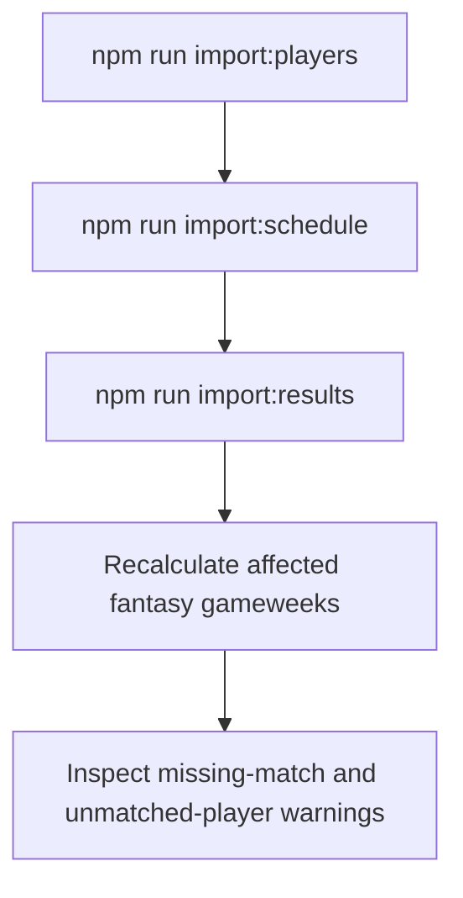

# Data imports

Player setup reads the committed catalogue offline; it never calls Profixio or
SBTF. STUPA remains the source for schedules and results. Schedule/result
scripts load `.env.local` and then `.env`; their dry runs fetch source data
without writing to Supabase. The player dry run requires no credentials or
network access.

## Required order

1. **Players** imports `data/player-catalogue.json` into local Supabase using
   permanent UUIDs and explicit prices for new rows. Existing prices stay intact.
2. **Schedule** creates STUPA rounds as gameweeks and their parent matches.
3. **Results** attaches STUPA submatches and player results, then recalculates
   player and fantasy-team points for every affected gameweek.


```mermaid
flowchart TD
    A[npm run import:players] --> B[npm run import:schedule]
    B --> C[npm run import:results]
    C --> D[Recalculate affected fantasy gameweeks]
    D --> E[Inspect missing-match and unmatched-player warnings]
```

## Configuration

Real imports require:

```dotenv
NEXT_PUBLIC_SUPABASE_URL=your-project-url
SUPABASE_SERVICE_ROLE_KEY=your-private-service-role-key
```

`SUPABASE_URL` may replace the public URL for scripts. Schedule and result
imports default to Stupa stage `5727`; set `STUPA_STAGE_ID` to override it.

## Player catalogue and local setup

`data/player-catalogue.json` is the environment-independent catalogue based on
the verified production rows: 10 clubs, 75 permanent player UUIDs (53 active
and 22 inactive/historical), first/last names, club UUIDs, active status,
explicit fantasy prices, and stored SBTF license and STUPA identity mappings.
Production is the authority for existing player UUIDs and values; local setup
reuses that committed snapshot rather than inventing environment-specific IDs.
`data/sbtf-rosters.json` remains the reviewed roster/name-alias reference used
for first-time STUPA matching; it is not a price source.

```bash
npm run import:players:dry  # offline catalogue validation, no database access
npm run import:players     # local Supabase only
```

`npm run import:players:catalogue` is an alias for the same local import.
`npm run dbsetup:local` uses it after rebuilding the local database. Both
import entry points read `.env.local` directly and refuse targets other than
`http://127.0.0.1:54321`, even if a hosted URL is set in the shell.

The importer validates the full catalogue and identity plan before writing.
It inserts missing players under their permanent UUIDs and copies their
explicit prices exactly. For existing players it updates only name, birth
year, club and active status, never price or ranking fields. It preserves
learned licenses/roles, historical aliases, ownership and historical records.
Rows absent from the catalogue are untouched: explicitly set `active: false`
to retire a player. Repeated imports make no further changes. Conflicting
UUIDs/licenses/roles stop the import for review; no automatic merge or deletion
is performed. Do not run concurrent catalogue writers.

Create a fresh read-only production comparison candidate before intentionally
resynchronizing existing catalogue rows:

```bash
npm run export:players:production-candidate
diff -u data/player-catalogue.json data/player-catalogue.production.json
```

This reads `.env.production` and requires its production Supabase URL and
service-role key. Safety checks require a hosted Supabase URL different from
staging. The command performs only paginated selects and writes the ignored
`data/player-catalogue.production.json`; it cannot modify production or the
committed catalogue. Review UUID, price, active-status and identity changes
before manually promoting the candidate.

An equivalent read-only staging comparison is also available:

```bash
npm run export:players:staging-candidate
diff -u data/player-catalogue.json data/player-catalogue.staging.json
```

It reads `.env.staging.local`, checks `APP_ENV=staging` and
`STAGING_PROJECT_REF`, and uses the anon key with public `clubs`/`players`
read policies. It never writes staging and writes only the ignored
`data/player-catalogue.staging.json` comparison file; it cannot replace the
committed catalogue. Because staging's public read policy does not expose the
identity table, its candidate reconstructs current identities from player
columns and is not a backup of historical aliases. Copy reviewed field changes
manually. Existing database aliases are retained by imports. Routine setup does
not run either hosted export.

### Add and deploy a player

Use one permanent player UUID in every environment. Add the player and any
`sbtf_license`/`stupa_user_role` identities to `data/player-catalogue.json`,
calculate and review the explicit price, then validate the complete catalogue:

```bash
node -e 'console.log(crypto.randomUUID())'
npm run calculate:player-price -- --ranking-points 2305 --world-ranking-position 98
npm run import:players:dry
npm run test:imports
npm run generate:player-migration -- --player-id <new-player-uuid>
```

The player row needs that UUID, the existing catalogue club UUID, first and last
name, `active`, a positive whole-number `price`, and any known birth year,
ranking, SBTF license (`profixio_id`) and STUPA role (`stupa_user_role_id`). Use
`null` for unknown optional values. Current license/role columns automatically
become identity aliases; put older aliases in `playerExternalIdentities`.

Repeat `--player-id` to put several new players in one migration. The generator
requires explicit catalogue UUIDs and refuses a UUID already marked in an older
generated migration. It includes the referenced clubs and identity aliases,
checks hosted UUID/license/role conflicts before writing, and uses insert-only,
idempotent SQL. Existing player rows, prices, ownership and history are never
updated or deleted. Review the generated SQL before applying it.

Apply and test the generated migration only against local Supabase. Commit the
catalogue and migration together, merge through `develop` for staging, then
promote the exact tested commit to `main` for production. Never run the generator
for the existing catalogue wholesale and never push or edit hosted data manually.

## Commands and writes

| Command | Source | Main writes |
| --- | --- | --- |
| `npm run import:players` | Committed catalogue | Local clubs, missing players, roster metadata and missing identity aliases; existing prices unchanged |
| `npm run generate:player-migration -- --player-id <uuid>` | Selected committed catalogue rows | One reviewed SQL migration file; no database connection |
| `npm run import:schedule` | STUPA stage matches | Clubs, gameweeks, matches |
| `npm run import:results` | STUPA completed submatches | Raw results, player stats, snapshot points, team totals |
| `npm run import:results -- --complete-gameweek-refresh` | Same STUPA import | Above, then pending gameweek scoring and completion marker |

Schedule and results have `:dry` variants. `STUPA_STAGE_ID` overrides the
default stage `5727`. Unlike the player dry run, these contact STUPA.

The daily and manual schedule imports recalculate a future gameweek's deadline
from its earliest fixture. Once the existing deadline has passed, imports keep
that gameweek's lock and unlock boundaries unchanged but continue updating its
individual fixture times and statuses. Existing fixtures retain their original
gameweek link when STUPA postpones them or moves their upstream round.

## Availability and prices

Active players with a valid configured price can be selected regardless of
`ranking_points` or `ranking_position`. Prices are positive whole currency
amounts. Ranking fields remain optional legacy data and do not drive prices,
selection, sorting or refresh completion. Fumiya Igarashi and Machi Asuka keep
their stored 10m prices and permanent UUIDs, show those prices in the picker,
and can be added subject to the normal budget and club limits.

Inactive players are hidden from the picker. Existing owners may keep and
save them at their preserved price, but cannot re-add them after selling.

### Manual price calculation for new players

Routine catalogue imports omit existing prices from updates, even if a
snapshot contains a different price. Editing a catalogue price only affects
new-player initialization. There is no automatic or scheduled price update.

The former fantasy price formula remains available as an offline manual tool:

```bash
npm run calculate:player-price -- --ranking-points 2305
npm run calculate:player-price -- --ranking-points 2305 --world-ranking-position 98
```

Enter the player's current Swedish ranking points and, when applicable, their
positive world-ranking position. The command returns the ranking component,
world-ranking component and final integer `price`; copy that final value into
the new player's entry in `data/player-catalogue.json`. It uses the former
formula exactly: a 2250-point floor, a 2200 offset, SEK 100,000 per point, plus
SEK 25,000,000 divided by the square root of the world-ranking position. The
command performs no network requests and makes no database or catalogue writes.
The catalogue price remains explicit and must pass `npm run import:players:dry`
before local import.

### Future explicit price updates

`scripts/import-fantasy-players.mjs` exposes `buildExplicitPriceUpdates` as a
separate boundary for a future reviewed pricing process: supply `{ id, price }`
values and current players to obtain validated, changed price rows. It rejects
unknown/duplicate UUIDs and invalid prices and never changes roster identities.
No CLI or scheduled job invokes it today. A future runner must apply those
explicit updates during a pending unlocked gameweek, before its completion
marker, preserving the existing database `preserve_team_cash_on_player_reprice`
trigger. That trigger adjusts completed owners' budgets using the locked squad
so their unspent cash stays unchanged. It is not a general repricing guarantee
outside that pending window.

### Club names and logos

`lib/clubs.ts` defines the SBTF display names, exact source aliases and logo
provenance. STUPA schedule imports and the UI share this map.
`Linden BTK Eskilstuna` and the `Esklistuna` spelling resolve to **Eskilstuna by
STIGA**. The separate **Eskilstuna BTK** is not treated as the same club.
Existing aliased club rows are renamed in place, preserving player, match and
historical snapshot references. Multiple existing rows for one canonical club
stop the import for reconciliation instead of creating another duplicate.
Stupa results continue to match parent matches and players by source IDs.

The app serves local copies of the seven logos linked from SBTF, under
`public/club-logos/sbtf-*`. It does not fetch SBTF assets or rosters in the browser.
Legacy stored fixture names are normalized for display as well.

### Player identity

Catalogue imports match permanent UUIDs. `players.profixio_id` retains its
legacy column name for the current SBTF license; `player_external_identities`
keeps historical/current licenses and STUPA roles. Neither represents a
Profixio network dependency. Existing current identities are never overwritten
by an older snapshot; newly supplied aliases are added without displacing them.

## Production player preservation

Ordinary application deployments do not seed or replace production's `players`
table. Only an explicitly generated and reviewed player data migration inserts
selected new catalogue UUIDs through the normal staging/production promotion.
The local catalogue importer and scheduled results workflow do not write hosted
player metadata or prices. Existing active and inactive players therefore keep
their UUID, stored price, status, ownership and history. The catalogue is not an
allowlist: rows absent from it are never deleted, and inactive players remain
retainable by existing owners but cannot be newly selected.

## Results refresh and transfer reopening

The results workflow uses `Europe/Stockholm` for all three cron triggers:

- **Every day at 00:07:** refresh the STUPA fixture schedule, then import all
  available stage results and recalculate affected gameweeks, including older
  corrected or delayed results. This runs even on days without matches.
- **Every 15 minutes on match days (:07, :22, :37, :52):** once that day's first
  fixture has started, import and score results at each slot until midnight. This continues
  after matches finish so late results can arrive. A start between slots is
  picked up at the next slot.
- **Multi-day gameweeks:** use the individual fixture dates, not the entire
  gameweek's date range. Each playing day gets its own interval; gap days and
  hours before the first match get only the daily check.
- **Manual workflow runs:** always refresh fixtures and results.

The lightweight cadence check reads at most one matching fixture from Supabase
before installing dependencies. It does not contact STUPA or write the database.
Only fixtures in the configured stage, attached to a gameweek, that started
since Stockholm midnight qualify. Cancelled/deleted/postponed fixtures do not
start the interval; already scored fixtures still do. The local check command
uses the exact same code and only accepts local Supabase:

```bash
npm run check:results-refresh:local -- --stage-id -900001
npm run check:results-refresh:local -- --stage-id -900001 --at 2026-09-21T20:00:00+02:00
npm run check:results-refresh:local -- --daily
npm run test:results-schedule
```

These commands report the decision without importing or scoring anything.
`-900001` is the synthetic test stage; omit it to check real stage `5727` locally.
Normal local `score` and `unlock` commands still execute the synthetic lifecycle.

The workflow explicitly shares stage `5727` between its check and both importers.
No new secrets or repository variables are needed. Sweden's summer/winter clock
changes are handled by the IANA timezone. The 00:07 trigger is identified by
its cron expression, so it is not accidentally skipped if the runner starts late.
GitHub Actions schedules run on the default branch and can be delayed or dropped;
these are target polling times, not exact-time guarantees. See
[GitHub's schedule documentation](https://docs.github.com/en/actions/reference/workflows-and-actions/events-that-trigger-workflows#schedule).
No changes are live until the workflow is promoted to the default branch.

Every due results import uses `--complete-gameweek-refresh`.
Only after result persistence and scoring succeed does it score the oldest
pending gameweek that was already unlocked when the import began, then record
`data_refreshed_at`. That clears the gameweek's refresh lock without touching
prices or budgets. Other pending/locked gameweeks still keep transfers closed.
If fetching, persistence, identity validation or scoring fails, completion is
not reached. Missing scheduled parent matches also block completion. The job
retries a failed results import once; writes and scoring can safely be repeated.
Dry runs never complete gameweeks.

There is no standalone completion command and no Profixio fallback. No price
refresh GitHub variable or new Vercel environment variable is needed. Existing
STUPA/Supabase configuration stays in use.

## Schedule behavior

One fantasy gameweek is built per Stupa round. Transfers lock two hours before
the first match. The earliest reopening is 00:00 Swedish time on the day after
the last match; actual reopening happens when the subsequent results import and scoring succeed. Source times are interpreted in `Europe/Stockholm` and stored
as UTC timestamps.

## Result identity matching

Stupa's `meta_data.license_id` is matched against every historical SBTF license
in `player_external_identities`. Its `user_role_id` is an independent fallback
identity, so a known role can still resolve a newly changed license. Each new
license and role association is retained for later imports. If the license and
role resolve to different players, the live import stops rather than assigning
points incorrectly. The same check covers roster fallback matches and any
new identity claimed by different players within the same import batch.

For explicitly UUID-anchored roster entries (currently Fumiya Igarashi and
Machi Asuka), an exact normalized roster name or approved alias together with
the parent fixture's club can establish the first Stupa link. The anchored
player must already exist, be active, and still belong to that roster club.
Namesakes in the database are ambiguous and stop the import. This fallback
does not perform fuzzy matching or infer arbitrary name-order changes.

Unmatched people remain in `player_submatch_results` with a null `player_id`.
They are skipped for fantasy points without blocking matched players, scoring,
or gameweek completion. Keep their raw rows: an unknown doubles partner must
still count toward the side size so the known partner receives doubles points.
No player is automatically created or assigned a price.

Local imports and dry runs print one warning per unmatched identity, listing
the name, clubs, license, STUPA role and all affected fixture IDs. In GitHub
Actions the same messages appear as warning annotations in the workflow run.
Review the catalogue and identity mappings, then rerun the results import to
link the retained rows and recalculate affected gameweeks. Outside explicitly
anchored roster entries, names are diagnostic only because they are neither
unique nor consistently formatted across both sources. Conflicting identities
still stop the import rather than assigning points to the wrong person.

This applies to unknown players in scheduled fixtures, including a source club
name absent from the roster reference. If the entire parent fixture is missing
from the database, the schedule must be imported first; that separate condition
still blocks gameweek completion.

## Troubleshooting

### Read-only result verification, 20 September 2026

- Fetched the public STUPA stage `5724` response using the same endpoint and
  headers as the results importer. No database was read or written.
- The women's stage returned 55 scheduled fixtures, with 10 scored fixtures
  across rounds 1 and 2: 73 scored submatches, including five doubles, and 156
  player-result rows. All 40 participating players had both a license and role
  ID, with no conflicting associations in the response.
- Passed the response through the actual `buildImportRows` parser using isolated
  sample player identities. All rows resolved by license alone and by role
  alone; winners, set totals and individual set scores matched the response.
  Changing source names did not change the resolved IDs; repeated parsing
  produced the same identities and statistics.
- Against the committed men's catalogue, all 40 women were correctly unmatched
  with no identity conflicts. This validates the source format and matching
  mechanism, not production's identity coverage or a women's fantasy roster.
- Scoring links resolved `player_id` values to the same UUIDs in
  `fantasy_team_gameweek_players`; lineup/captain/chip state and club membership
  come from the locked gameweek snapshots. Neither identity matching nor this
  scoring join needs ranking data, price updates or a Profixio request.
- Existing import and scoring regression suites passed. No women's data was
  imported and no database scoring was executed for this live sample. A new
  player whose license and role are both unknown still needs an explicit mapping
  (or an approved anchored roster fallback); raw unmatched results are retained.

### Matching verification, 14 September 2026

- The live stage `5727` returned 42 fixtures across the same seven clubs as the
  SBTF roster. Importing its schedule locally created 14 gameweeks and 42
  fixtures, using the existing club records.
- The local roster contained all 53 players and the 51 configured SBTF license
  identities. A separate scored Stupa sample (stage `4521`, a different
  competition) matched 17 result rows for Hugo Jobs and Noa Dahlström through
  their actual licenses without identity conflicts.
- Regression tests cover both manual UUIDs, approved aliases, wrong clubs,
  namesakes, identity conflicts within one batch, doubles, and all 51 roster
  licenses. Run `npm run test:imports`.
- A rollback-only local database check passed importer-generated unranked
  results through `calculate_fantasy_gameweek_points`: each player earned 14
  points (singles 7 + doubles 4 + club win 3), their locked squad received those
  points, and the team total was 42 with captain doubling. Recalculation was
  idempotent. No ranking or license was required.
- The current season had **no scored submatches**, so real result coverage for
  all 53 players remains unverified until Stupa publishes their appearances.
  Unexpected names or missing identities will still be reported for review.

### Import problems

- **Missing environment variable:** add the named value to `.env.local`.
- **Missing scheduled parent matches:** run the schedule importer for the same
  stage before importing results.
- **Unmatched Stupa player:** check the Stupa license ID against the player's
  stored SBTF license (`profixio_id`); the raw row is retained and can be linked later.
- **Database column/table missing:** check the environment's migration status in
  GitHub Actions and deploy the pending timestamped migration before retrying.
- **Unexpected source response:** use a dry run and confirm that the configured
  stage exists and the upstream endpoint still returns its expected shape.

Every results import reloads the full Stupa stage. New or changed source rows
replace their stored rows, and every gameweek present in that result set is
recalculated against its locked squad snapshots. This means a later import also
repairs points for an earlier gameweek when a previously missing or inaccurate
score has changed upstream. Player club-win bonuses require an imported
appearance in the winning fixture and use the immutable
`player_gameweek_club_snapshots` club captured at that gameweek's lock, not the
current club on `players`. Other players registered to the winning club receive
no fixture-win bonus.
