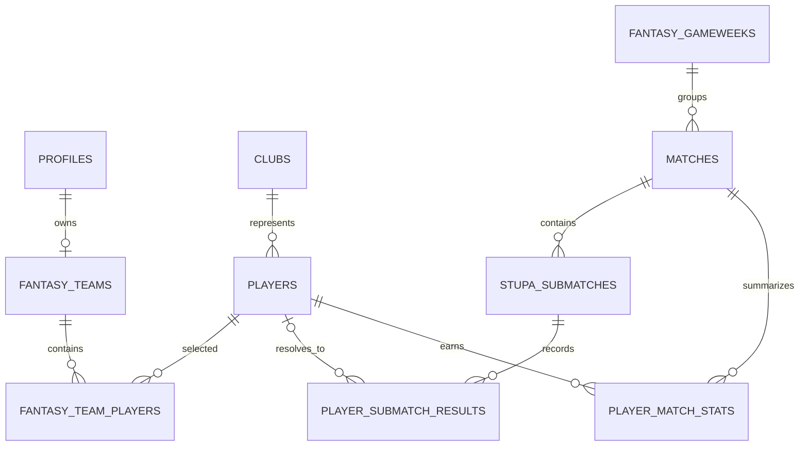

# Database model

`supabase/schema.sql` is the complete schema for a new Supabase project. The
separate migration files update projects that already have the schema installed.

## Main areas

- `profiles` mirrors application-specific user information from Supabase Auth.
- `fantasy_teams` is one user's team, name and budget.
- `fantasy_team_players` is the six-player squad, including position and captain.
- `fantasy_team_chip_selections` stores each team's pre-deadline chip pick for a
  gameweek, then records when that chip locks and when it is used.
- `players` and `clubs` contain imported ranking data. `profixio_id` is also used
  to match Stupa's `license_id`; `stupa_user_role_id` stores the Stupa identity.
- `fantasy_gameweeks` is created from Stupa rounds. Its first and last match
  timestamps produce the transfer lock window.
- `matches` contains the parent team fixtures required before results can load.
- `stupa_submatches` retains each source submatch and its raw payload.
- `player_submatch_results` retains per-player set and point details. Its
  `player_id` may be null when an imported identity cannot be matched.
- `player_match_stats` is intended for calculated fantasy points, not raw data.

## Authorization and business rules

RLS is enabled on application tables. Public sports data has read policies;
team data is limited to its owner. Server Actions still validate business rules
such as the four-starter/two-bench limit, one captain, budget and transfer lock.
The two-players-per-club rule is also enforced by a database trigger so writes
outside the application cannot bypass it.

The database functions `current_transfer_lock()`, `get_my_gameweek_progress()`,
`snapshot_locked_squads()`, `mark_used_chips()`,
`calculate_fantasy_gameweek_points()` and leaderboard-related RPCs provide
derived data to the application.
