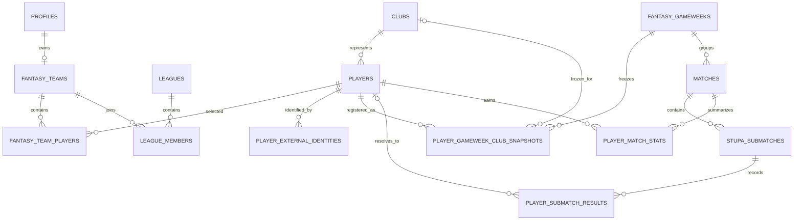

# Database model

`supabase/schema.sql` is the complete schema for a new Supabase project. The
separate migration files update projects that already have the schema installed.

```mermaid
erDiagram
    PROFILES ||--o| FANTASY_TEAMS : owns
    FANTASY_TEAMS ||--o{ FANTASY_TEAM_PLAYERS : contains
    FANTASY_TEAMS ||--o{ LEAGUE_MEMBERS : joins
    LEAGUES ||--o{ LEAGUE_MEMBERS : contains
    PLAYERS ||--o{ FANTASY_TEAM_PLAYERS : selected
    PLAYERS ||--o{ PLAYER_EXTERNAL_IDENTITIES : identified_by
    PLAYERS ||--o{ PLAYER_GAMEWEEK_CLUB_SNAPSHOTS : registered_as
    CLUBS ||--o{ PLAYERS : represents
    CLUBS o|--o{ PLAYER_GAMEWEEK_CLUB_SNAPSHOTS : frozen_for
    FANTASY_GAMEWEEKS ||--o{ PLAYER_GAMEWEEK_CLUB_SNAPSHOTS : freezes
    FANTASY_GAMEWEEKS ||--o{ MATCHES : groups
    MATCHES ||--o{ STUPA_SUBMATCHES : contains
    STUPA_SUBMATCHES ||--o{ PLAYER_SUBMATCH_RESULTS : records
    PLAYERS o|--o{ PLAYER_SUBMATCH_RESULTS : resolves_to
    MATCHES ||--o{ PLAYER_MATCH_STATS : summarizes
    PLAYERS ||--o{ PLAYER_MATCH_STATS : earns
```

## Main areas

- `profiles` mirrors application-specific user information from Supabase Auth.
- `fantasy_teams` is one user's team, name and budget. The budget represents
  current squad value plus unspent cash; it moves with owned-player price
  changes so a refresh does not change the team's available cash.
- `fantasy_team_players` is the six-player squad, including position and captain.
- `leagues` and `league_members` provide invite-only private leaderboards. The
  creator is added as the first member and can share the league's invite code.
- `fantasy_team_chip_selections` stores each team's pre-deadline chip pick for a
  gameweek, then records when that chip locks and when it is used.
- `players` and `clubs` contain imported ranking data. A player's UUID remains
  permanent when an upstream license changes. `player_external_identities`
  maps historical and current SBTF license and Stupa role IDs to that UUID;
  `players.profixio_id` remains the current license for compatibility.
- `fantasy_gameweeks` is created from Stupa rounds. Its first and last match
  timestamps produce the transfer lock window; `data_refreshed_at` records when
  the post-gameweek results and player-price refresh has reopened transfers.
- `matches` contains the parent team fixtures required before results can load.
- `stupa_submatches` retains each source submatch and its raw payload.
- `player_submatch_results` retains per-player set and point details. Its
  `player_id` may be null when an imported identity cannot be matched.
- `player_match_stats` stores calculated singles, doubles, set, fixture-bonus,
  walkover and gameweek-bonus points derived from the raw Stupa rows.
- `player_gameweek_club_snapshots` freezes every player's club and active state
  when a gameweek locks. Historical fixture-win bonuses use this roster instead
  of the player's current club, so later transfers and imports cannot change an
  old gameweek during recalculation. An inactive player retained in a locked
  fantasy squad remains eligible for their frozen club's win bonus.

## Authorization and business rules

RLS is enabled on application tables. Public sports data has read policies;
team data is limited to its owner. Squad mutations go through one atomic RPC
and require exactly four starters and two bench players. Server Actions also
validate business rules such as one captain, budget and transfer lock.
An inactive player already owned by a team may remain at their preserved price,
but inactive players cannot be newly selected or re-added after transfer.
The two-players-per-club rule is also enforced by a database trigger so writes
outside the application cannot bypass it. Completed fantasy teams must have a
unique name, compared case-insensitively; unfinished teams may share the
placeholder name used during onboarding. A player-price trigger uses the latest
pending gameweek snapshot to preserve each completed team's cash when a player
from that squad is repriced. Squad and chip writes remain blocked until the
post-gameweek data refresh succeeds. The lock job skips incomplete legacy
squads, so their first complete squad enters the next available gameweek with
no transfer history from a missed gameweek.

The database functions `current_transfer_lock()`, `get_my_gameweek_progress()`,
`get_my_played_gameweek_progress()`,
`snapshot_locked_squads()`,
`calculate_player_match_stats()`, `calculate_fantasy_gameweek_points()` and
leaderboard-related RPCs provide
derived data to the application. Private league creation, invitation joining,
listing and rankings go through security-definer RPCs that verify the signed-in
user and league membership.
